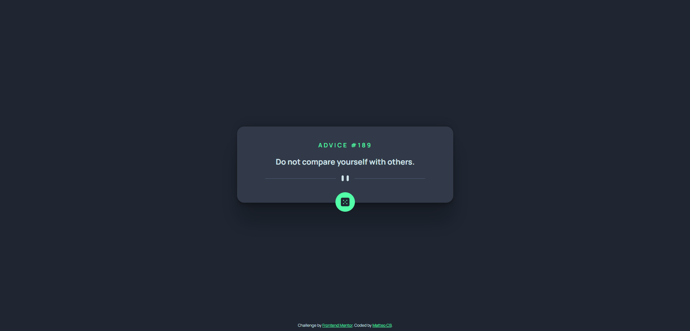

# Generator API - Générateur de Conseils

## Description

Generator API est un projet développé en utilisant React et l'API adviceslip. Il s'agit d'un générateur de conseils aléatoires qui peuvent être considérés ou non. L'application vous permet de générer un nouveau conseil en appuyant sur un bouton. Voici comment vous pouvez utiliser cette application :

## Fonctionnalités

- Génération de conseils : L'application se connecte à l'API adviceslip pour obtenir un conseil aléatoire à afficher à l'utilisateur.

- Actualisation du conseil : En appuyant sur le bouton vert, un nouveau conseil est généré et affiché à l'écran.

- Les conseils peuvent être mauvais et par conséquent ne doivent pas être suivi !

## Prérequis

Avant de pouvoir utiliser cette application, assurez-vous d'avoir les éléments suivants :

- Node.js installé sur votre machine
- Un navigateur web compatible

## Guide d'installation

1. Clonez le dépôt du projet depuis GitHub : `git clone https://github.com/Matteo-CB/generator-api.git`

2. Accédez au répertoire du projet : `cd generator-api`

3. Installez les dépendances requises en exécutant la commande suivante : `npm install`

4. Lancez l'application en exécutant la commande : `npm start`

5. Ouvrez votre navigateur et accédez à l'URL suivante : `http://localhost:3000`

Vous devriez maintenant pouvoir utiliser l'application Generator API localement sur votre machine.

## Limitations

Veuillez noter les limitations suivantes de cette application :

- Les conseils sont générés à partir de l'API adviceslip. La disponibilité et l'exhaustivité des conseils peuvent varier.

- L'application nécessite une connexion Internet active pour fonctionner correctement.

